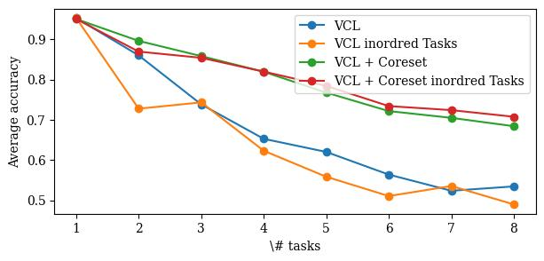

# Exploring Catastrophic Forgetting in Continuous Learning

In this project, our main objective is to study and analyze the different factors that contribute to the phenomenon of catastrophic forgetting in continuous learning. We seek to understand how characteristics of the datasets influence this phenomenon.

## Used Benchmarks

- MNIST and Cifar-10: you just need to execute the load_datasets() that is in utilsP.py File
- Rotated MNIST: the rotatedMNISTgenerationForVCL is a generator that create rotated Mnist datasets and prepare them for the VCL algorithms based on the file data/mnist.pkl.gz

## explanation of the files:

- OurEmbeddings.py: This file includes the preparation of rotated datasets and the embeddings using Task2Vec, as described in our report.
- OurVCL.py: This file is used to execute VCL and coreset VCL on the various experiments detailed in our report.
- Paper_rotated_mnistVCL: This file is used to execute VCL and coreset VCL on the tasks as described in the research paper.
- PaperEmbaddings.py: This file handles the preparation of tasks and the embeddings using Task2Vec, as described in the research paper.
- PaperVCL.py: This file is used to execute VCL and coreset VCL on the tasks generated according to the research paper's methodology.
- rotatedMNISTgenerationForVCL.py: This file generates a rotated MNIST dataset with a user-specified rotation angle
- utilsP.py: This file includes all the functions necessary for creating the tasks outlined in the research paper

## requirment:

- This code is executed in an environment running Python 3.12 with TensorFlow 2.16.

## Results for our approches described in the report

## Contact Information

This work is part of our Deep Learning course in the Master 2 Autonomous Systems program, completed by Talout Chattah and Yara Halawani

- **Name:** Yara Halawani
- **Email:** [yarahalawani02@gmail.com ](mailto:yarahalawani02@gmail.com)
- **LinkedIn:** [linkedin.com/in/yaraelhalawani/](https://www.linkedin.com/in/yaraelhalawani)
---
- **Name:** Talout Chattah
- **Email:** [taloutchattah2001@gmail.com](mailto:taloutchattah2001@gmail.com)
- **LinkedIn:** [linkedin.com/in/talout-chattah](https://www.linkedin.com/in/talout-chattah)

